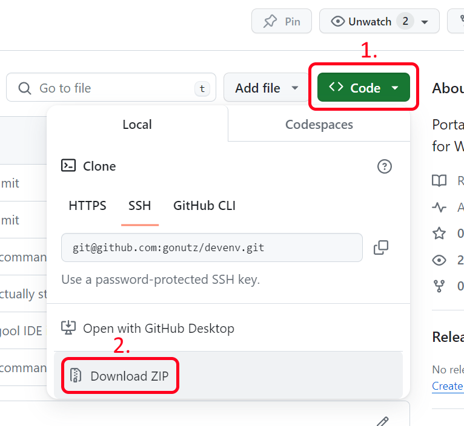
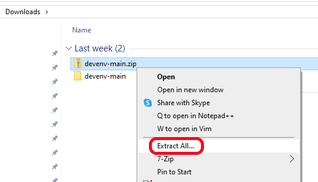
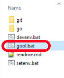

Stunde 0
========

Installieren der Programmierumgebung
------------------------------------

1. Im Browser die folgende URL öffnen:

    https://github.com/gonutz/devenv

2. Den Button `Code` klicken und dann auf `Download ZIP` klicken um das Projekt
   herunter zu laden.

3. Im Windows Explorer zum Download-Ordner navigieren und dort auf die Datei
   `devenv-main.zip` rechtsklicken. Dann `Alle extrahieren` klicken. Im sich
   öffnenden Dialog auf `Extrahieren` klicken.

4. Den extrahierten Ordner öffnen und doppelt auf `gool.bat` klicken, um die
   Entwicklungsumgebung zu starten.

