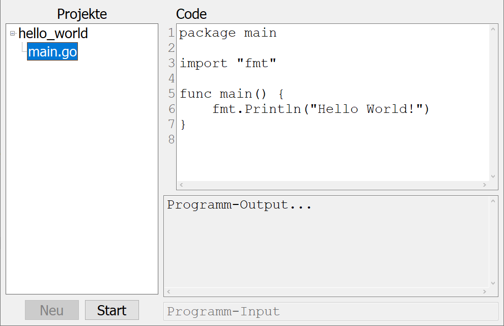

Stunde 0
========

Installieren der Programmierumgebung
------------------------------------

1. Im Browser die folgende URL öffnen:

    https://github.com/gonutz/devenv

2. Den Button `Code` klicken und dann auf `Download ZIP` klicken um das Projekt
   herunter zu laden.

3. Im Windows Explorer zum Download-Ordner navigieren und dort auf die Datei
   `devenv-main.zip` rechtsklicken. Dann `Alle extrahieren` klicken. Im sich
   öffnenden Dialog auf `Extrahieren` klicken. Das Extrahieren dauert mehrere
   Minuten.

4. Den extrahierten Ordner öffnen und doppelt auf `gool.bat` klicken, um die
   Entwicklungsumgebung zu starten.

5. Beim ersten Start von Gool wird im extrahierten Ordner ein Unterordner `bin`
   und darin ein Unterordner `gool_projects` angelegt. Ein Projekt
   `hello_world` wird beim ersten Start erzeugt. Dieses `hello_world` Projekt
   erscheint in Gool auf der linken Seite. Das Prjekt kann im Projektbaum
   aufgeklappt werden. Ein Doppelklick auf `main.go` öffnet den Code im Editor.
   Der `Start` Button führt das Programm aus.

