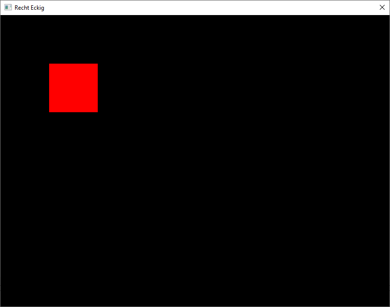

Stunde 2
========

Das "Hello World" Programm aus der letzten Stunde hat Text auf der Konsole
(Kommandozeile) angezeigt. Jetzt soll ein Fenster mit grafischer Ausgabe
angezeigt werden.

Dazu legen wir im Windows Explorer einen neuen Ordner `graphics` an. In diesem
Ordner erstellen wir die Datei `main.go` mit folgendem Inhalt:

```
package main

import "github.com/gonutz/prototype/draw"

func main() {
	draw.RunWindow("Recht Eckig", 800, 600, func(window draw.Window) {
		window.DrawRect(100, 100, 100, 100, draw.Red)
	})
}
```

Als Ergebnis sehen wir ein rotes Quadrat in einem schwarzen Fenster. Das
Fenster hat den Titel "Recht Eckig". Die innere, schwarze Fläche des Fensters
ist 800 Pixel breit und 600 Pixel hoch.



Aufgaben
--------

- Verändere die Zahlen im Programm (800, 600, vier mal 100) um herauszufinden
  was sie bedeuten.

- Versuche die Farbe des Rechtecks zu ändern.

- Versuche mehrere verschiedene Rechtecke auf dem Bildschirm zu zeichnen.

**Hinweis:** die Dokumentation der `draw` Bibliothek findest Du unter:

    https://pkg.go.dev/github.com/gonutz/prototype/draw
